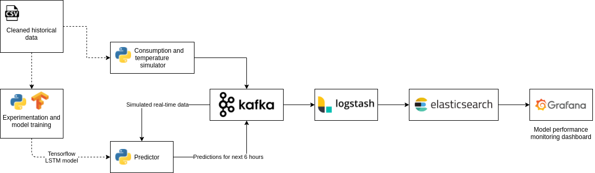
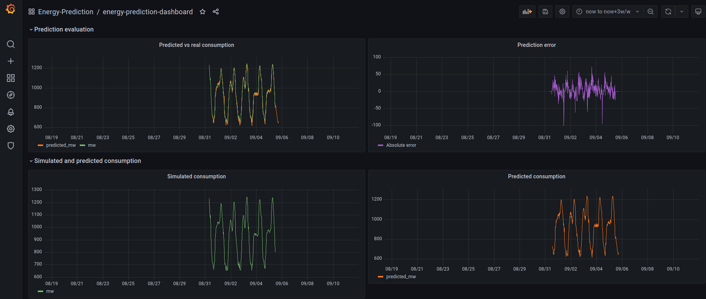

# energy-prediction-demo

A use case demo for energy production optimization. In order to reduce energy use loss, accurate energy consumption prediction is necessary.

The demo data has been provided by [Stromnetz Berlin Open Data](https://www.stromnetz.berlin/technik-und-innovationen/open-data).

Several Tensorflow time-series forecasting model architectures and hyperparameter combinations have been tried and are documented in a Jupyter Notebook.
The final model is a LSTM network taking 48 timesteps (consumption in mW, temperature, daytime) as input and producing predictions of 24 future timesteps (consumption in mW).

As no live data is available, I implement a simple Python live data simulator which continuously repeats historical time-series with added noise.

Apache Kafka is used to store simulated and predicted data and connect components.

A Grafana dashboard compares simulated and predicted data and monitors model performance. It is connected to Kafka via Logstash and Elasticsearch.

## Run project
You will require
* docker + docker-compose

Run start.sh script to build containers and start docker-compose

    sh start.sh

When you are done, end the session by

    docker-compose down

## Access Grafana dashboard
Wait for a few minutes for the simulation and prediction processes to produce sufficient data.

You can access a Grafana dashboard monitoring the prediction model performance under:

http://localhost:3000/d/energy-prediction-dashboard/energy-prediction-dashboard?orgId=1

You will be required to login to Grafana by using the following credentials.

    Login: admin
    Password: admin

## Read more about the data cleaning and predictive model training process

Steps of data cleaning, predictive model architecture choice and model hyperparameter tuning are described in detail in [the Jupyter Notebook model training documentation](model-training/model-training-documentation.ipynb).

To be able to work with the Notebook interactively you will require a Python environment with Jupyter library and other required packages.

    cd model-training
    pip install -r requirements.txt
    jupyter notebook
